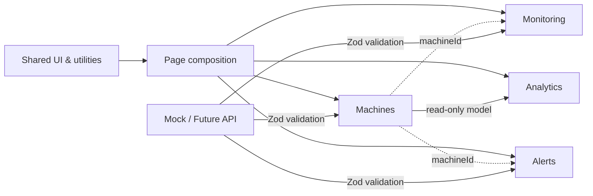

# Fearyn Demo Architecture

## 設計原則

1. 頁面只負責組裝，不定義領域資料形狀或運算規則。
2. 外部／示範資料進入領域時先通過 Zod schema。
3. 領域間只依賴公開型別與 selector/service，不共享可變模型。
4. `shared/` 不可匯入任何 `domains/` 或 `pages/`。
5. 跨頁狀態由對應領域 Zustand store 擁有；局部表單與瞬時狀態留在元件。

## Bounded Contexts

### Machines

**責任**：機台主檔、位置、操作人員、連線與目前加工狀態。

**語言**：Machine、Status、Area、Operator、Job、Health、Risk。

### Monitoring

**責任**：即時遙測、感測器訊號、波形與更新週期。

**語言**：Telemetry、Sample、Waveform、Cutting Force、Tool Wear。

僅透過 `machineId` 關聯 Machines，不修改機台主檔。

### Alerts

**責任**：異常事件從 `new`、`acknowledged` 到 `resolved` 的生命週期與處置契約。

**語言**：Alert、Severity、Owner、Resolution、Suggestion。

`alert.store` 管理事件、篩選、選取與生命週期；狀態持久化至瀏覽器儲存空間。

### Analytics

**責任**：從機台資料計算艦隊健康度、利用率、OEE 與趨勢資料。

**語言**：Fleet Summary、Utilization、Availability、OEE、Energy Trend。

只讀取 Machines 的公開模型，不反向修改來源。

## Context Map



## 允許的依賴方向

```text
main → app → pages → domains → shared
                    ↘ shared
```

- `app` 組裝 routes，各領域透過 Zustand store 暴露狀態與 actions。
- `pages` 可跨 domain 組裝 use case。
- `domains` 不可匯入 `pages` 或 `app`。
- `shared` 必須保持無業務語意。

## API 串接策略

1. 在個別 domain 增加 `api/` adapter。
2. 回應資料先由既有 schema `parse` 或 `safeParse`。
3. adapter 回傳 domain model，頁面介面保持不變。
4. 即時資料可將 `useLiveMachine` 的 interval adapter 替換成 WebSocket/SSE adapter。
5. 告警指令可在 `alert.store` actions 後方加入 repository，維持既有 action contract。